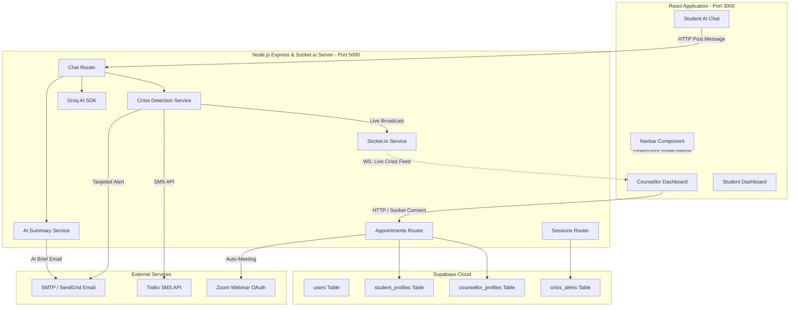

# 🧠 Mindful Space: College Counselling & Crisis Intervention Portal

A premium, production-ready, full-stack mental health portal designed for university environments. This platform bridges the gap between students, AI-driven wellness bots, and professional college counsellors, complete with real-time alerts, automatic slot scheduling, and robust privacy boundaries.

---

## 🌟 Core Features

### 1. 🤖 AI-Driven Counselling Bot
* **Empathetic Wellness Chat**: Direct contextual integration using the Groq SDK (Llama 3 model) to provide professional, low-barrier clinical dialogue.
* **Sentiment & Mood Analytics**: Asynchronous background sentiment analysis running after each bot exchange, logging student mood curves dynamically.

### 2. 🤝 Student-Counsellor Auto-Allocation & Strict Privacy
* **Automated Assignment**: Assigns a student to a dedicated counsellor automatically upon their first appointment booking.
* **Privacy Isolation**: Strict server-side verification blocks unauthorized counsellors from accessing other students' records or clinic dashboard folders (`403 Forbidden`). Only the assigned counsellor has access.
* **Regular Email Briefings**: Generates AI chat summaries (with a 10-minute spam protection cooldown) and sends them directly to the student's allocated counsellor.

### 3. 🚨 Real-Time Crisis Detection & Targeted Routing
* **Keyword Matching**: Scans all student messages against a clinical keyword list (e.g., self-harm, severe distress).
* **Direct Alert Routing**: Instantly targets alerts to the student's assigned counsellor's email, SMS (via Twilio), and counsellor dashboard feed (via Socket.io).
* **Fallback Safety**: Dynamically routes to duty counsellors or fallback college administrators if no dedicated counsellor is assigned.

### 4. 🔄 Cancel & Reassign Workflows (Race-Condition Free)
* **First-Come-First-Serve**: Employs optimistic database locking (`version` key checks) to prevent double-booking.
* **Sequential Offers**: Sends reassignment requests one-by-one to other available counsellors (with 2-minute expiring timers).

### 5. 📅 Day-Order Appointment Matching & Zoom SDK
* **Slot Rotation**: Automatically syncs appointments with the university's active academic day-order rotation schedule.
* **Automated Virtual Meeting Rooms**: Creates Zoom SDK webinars and sends scheduling confirmation updates to both student and counsellor.

---

## 📊 System Architecture



---

## 🛠️ Installation & Setup

### Prerequisites
* **Node.js**: Version 18.0.0 or higher
* **npm**: Package Manager

### 1. Environment Configurations
Create a `.env` file in the **root** folder:
```env
PORT=5000
FRONTEND_URL=http://localhost:3000

# Supabase Configurations
SUPABASE_URL=https://your-project-id.supabase.co
SUPABASE_ANON_KEY=eyJhbGciOiJIUzI1...
SUPABASE_SERVICE_ROLE_KEY=eyJhbGciOiJIUzI1...
JWT_SECRET=your_jwt_secret

# AI SDK Configurations
GROQ_API_KEY=gsk_your_groq_key_here

# Mailing Configurations (SMTP/SendGrid)
EMAIL_FROM=mindspaceotp@gmail.com
EMAIL_HOST=smtp.sendgrid.net
EMAIL_USER=apikey
EMAIL_PASS=SG.your_sendgrid_key_here
EMAIL_PORT=587
EMAIL_SECURE=false

# Twilio SMS Configurations (Optional)
TWILIO_ACCOUNT_SID=
TWILIO_AUTH_TOKEN=
TWILIO_FROM_NUMBER=
TWILIO_ADMIN_NUMBER=

# Zoom SDK Integration
ZOOM_ACCOUNT_ID=
ZOOM_CLIENT_ID=
ZOOM_CLIENT_SECRET=
ZOOM_SECRET_TOKEN=
```

### 2. Database Schema Migrations
Before running the backend, execute the SQL migration scripts in your **Supabase Dashboard SQL Editor** in the following order:
1. `supabase/schema_complete.sql` (Creates core tables: users, profiles, mood, appointments).
2. `supabase/schema_sessions_migration.sql` (Session tracking & audit tables).
3. `supabase/add_assigned_counsellor.sql` (Counsellor allocation fields).

---

### 3. Running Backend (Node.js API)
```bash
cd backend
npm install
npm run dev
```
*Runs on `http://localhost:5000`*

### 4. Running Frontend (React SPA)
```bash
cd frontend
npm install
npm start
```
*Runs on `http://localhost:3000`*

---

## 🧪 Verification & Tests
The project includes self-contained verification scripts to validate configurations and database relationships:

* **Verify Database Column Relationships & Schema**:
  ```bash
  node backend/check-tables-exist.js
  ```
* **Verify Privacy, Auto-allocation, Summarization, and Crisis Routing**:
  ```bash
  node backend/test-allocation-logic.js
  ```
